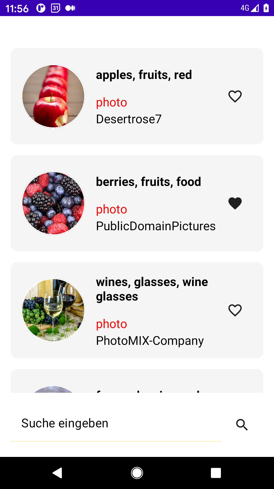
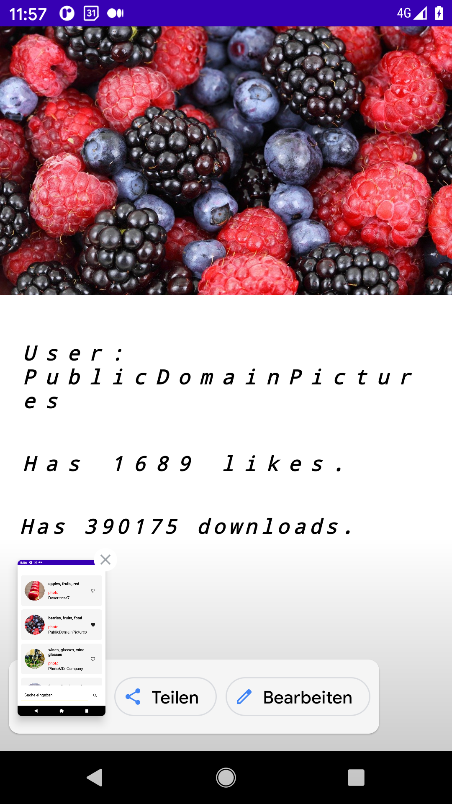

### Coding Example using jetpack compose 

This is a basic android example that uses jetpack compose,
dagger-hilt, navigation and other libraries 
generally used in android apps. It has three screens.
On home screen you can search for images and mark 
items as favourite, open the web site on pixaba 
or open a pager view in a slide show mode. 
If you click on an item you land on the detail screen. 
There you see a larger version of the image 
and some data related to the image.

To be able to load data you need to create an account 
on pixabay.com and register the apiKey in a file
next to the project root. See the todo in build.gradle of the 
app.

